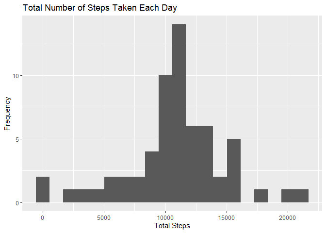

## Loading and preprocessing the data

```r
unzip("activity.zip")
df <- read.csv("activity.csv")
df$date <- as.Date(df$date)
```
  
  
  
  
## What is mean total number of steps taken per day?

```r
options(scipen = 1, digits = 2)

library(dplyr)
```

```
## 
## Attaching package: 'dplyr'
```

```
## The following objects are masked from 'package:stats':
## 
##     filter, lag
```

```
## The following objects are masked from 'package:base':
## 
##     intersect, setdiff, setequal, union
```

```r
library(ggplot2)
dfSum <- df %>% group_by(date) %>% 
      summarize(TotSteps = sum(steps)) 

ggplot(dfSum, aes(x = TotSteps)) +
  geom_histogram(bins = 20) +
  labs(x = "Total Steps", y = "Frequency", title = "Total Number of Steps Taken Each Day")
```

```
## Warning: Removed 8 rows containing non-finite values (stat_bin).
```

<!-- -->

```r
MeanTotSteps <- mean(dfSum$TotSteps, na.rm = TRUE)
MedianTotSteps <- median(dfSum$TotSteps, na.rm = TRUE)
```
The mean of the total number of steps taken per day: 10766.19  
The median of the total number of steps taken per day: 10765
  
  
  
  
## What is the average daily activity pattern?

```r
library(scales)

dfSum <- df %>% group_by(interval) %>% 
      summarize(MeanSteps = mean(steps, na.rm = TRUE))

dfSum$time <- sprintf("%04d", dfSum$interval)
dfSum$time <- as.POSIXct(strptime(dfSum$time, format = "%H%M"), tz="GMT")

ggplot(dfSum, aes(x = time, y= MeanSteps)) +
      geom_line() +
      labs(x = "Time Interval", y = "Average Steps", 
           title = "Number of Steps Taken, Averaged Across All Days") +
      scale_x_datetime(breaks = date_breaks("4 hour"), labels=date_format("%H:%M"))
```

<!-- -->

```r
MaxStepInt <- dfSum$interval[dfSum$MeanSteps == max(dfSum$MeanSteps)]
```
5-minute interval containing the maximum number of steps: 835   
  
  
  
  
## Imputing missing values

```r
TotNA <- sum(is.na(df$steps))

## Missing values filled with mean values of corresponding 5-minutes interval
## Calculate mean values for each interval
dfMed <- df %>% group_by(interval) %>% 
      summarize(MedSteps = mean(steps, na.rm = TRUE))

## Add mean values to data frame
dfImputed <- left_join(df, dfMed)
```

```
## Joining, by = "interval"
```

```r
## find rows with missing values
na.id <- which(is.na(df$steps))

## Replace missing values by mean values
dfImputed[na.id, "steps"] <- dfImputed[na.id, "MedSteps"]
dfImputed <- select(dfImputed, -MedSteps)

## Make a histogram and calculate mean and mean values
dfSum <- dfImputed %>% group_by(date) %>% 
      summarize(TotSteps = sum(steps)) 

ggplot(dfSum, aes(x = TotSteps)) +
  geom_histogram(bins = 20) +
  labs(x = "Total Steps", y = "Frequency", title = "Total Number of Steps Taken Each Day")
```

<!-- -->

```r
MeanTotStepsImputed <- mean(dfSum$TotSteps)
MedianTotStepsImputed <- median(dfSum$TotSteps)

MeanImpact <- MeanTotStepsImputed - MeanTotSteps
MedianImpact <- MedianTotStepsImputed - MedianTotSteps
```
Total number of missing values in the dataset: 2304  
Impact of imputing missing data on the estimates of the total daily number of steps:  
- Mean Value: 0  
- Median Value: 1.19  
  
    
## Are there differences in activity patterns between weekdays and weekends?

```r
Sys.setlocale("LC_ALL","English")
```

```
## [1] "LC_COLLATE=English_United States.1252;LC_CTYPE=English_United States.1252;LC_MONETARY=English_United States.1252;LC_NUMERIC=C;LC_TIME=English_United States.1252"
```

```r
dfImputed$Week <- factor(ifelse(weekdays(dfImputed$date) %in% c("Saturday", "Sunday"), "weekend", "weekday"))

dfSum <- dfImputed %>% group_by(Week, interval) %>% 
      summarize(MeanSteps = mean(steps))

dfSum$time <- sprintf("%04d", dfSum$interval)
dfSum$time <- as.POSIXct(strptime(dfSum$time, format = "%H%M"), tz="GMT")

ggplot(dfSum, aes(x = time, y= MeanSteps)) +
      geom_line() +
      facet_grid(Week ~ .) +
      labs(x = "Time Interval", y = "Average Steps", 
           title = "Number of Steps Taken, Averaged Across All Days") +
      scale_x_datetime(breaks = date_breaks("4 hour"), labels=date_format("%H:%M"))
```

<!-- -->
  
  
